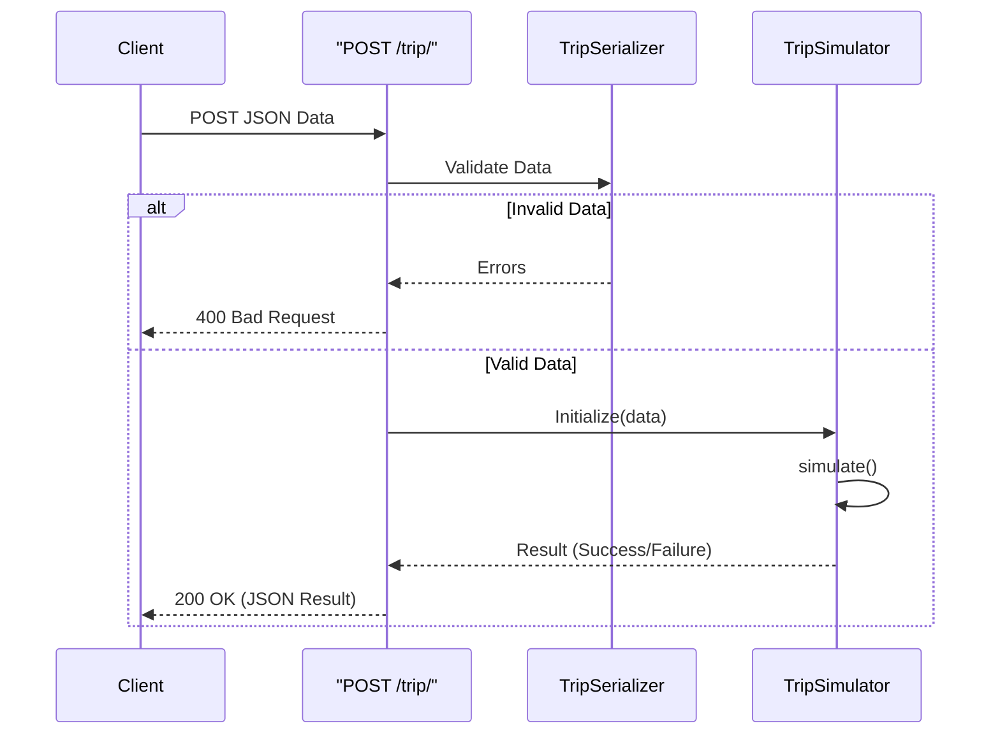
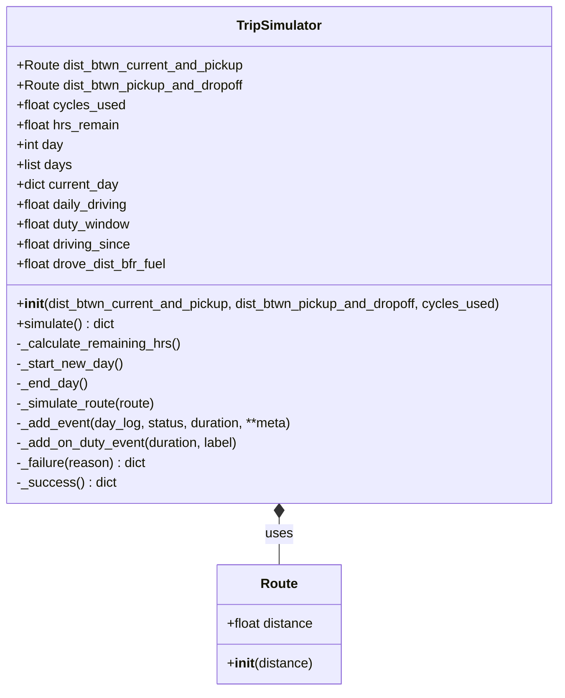

# HOS ELD Trip Planner Documentation

## API Endpoints

### Simulate Trip

**Endpoint:** `POST /trip/`

**Description:** Simulates a trip based on distances and cycle usage, returning a log of events (Driving, Break, On Duty, Off Duty) ensuring compliance with HOS (Hours of Service) regulations.

**Request Body (JSON):**

| Field | Type | Required | Description |
| :--- | :--- | :--- | :--- |
| `dist_btwn_current_and_pickup` | Integer | Yes | Distance in miles from current location to pickup. |
| `dist_btwn_pickup_and_dropoff` | Integer | Yes | Distance in miles from pickup to dropoff. |
| `cycles_used` | Integer | Yes | Number of hours already used in the current 70-hour cycle (Max 70). |

**Example Request:**
```json
{
    "dist_btwn_current_and_pickup": 2050,
    "dist_btwn_pickup_and_dropoff": 1050,
    "cycles_used": 0
}
```

**Response (JSON):**

| Field | Type | Description |
| :--- | :--- | :--- |
| `days` | Object | Contains the simulation result. |
| `days.status` | String | "SUCCESS" or "FAILED". |
| `days.logs` | Array | List of daily logs (if SUCCESS). |
| `days.reason` | String | Reason for failure (if FAILED). |

**Example Success Response:**
```json
{
    "days": {
        "status": "SUCCESS",
        "logs": [
            {
                "day": 1,
                "events": [
                    { "status": "DRIVING", "duration": 1, "miles": 55 },
                    { "status": "BREAK", "duration": 0.5 }
                ]
            }
        ]
    }
}
```

**Example Failure Response:**
```json
{
    "days": {
        "status": "FAILED",
        "reason": "No more cycle hours remained"
    }
}
```

## Required Environment Variables

The application requires the following environment variables to be set in a `.env` file in the project root:

| Variable | Description | Example |
| :--- | :--- | :--- |
| `SECRET_KEY` | Django secret key for cryptographic signing. | `django-insecure-...` |
| `DEBUG` | specific boolean to enable/disable debug mode. | `True` or `False` |

## Diagrams

### API Flow Diagram



### TripSimulator Class Diagram


