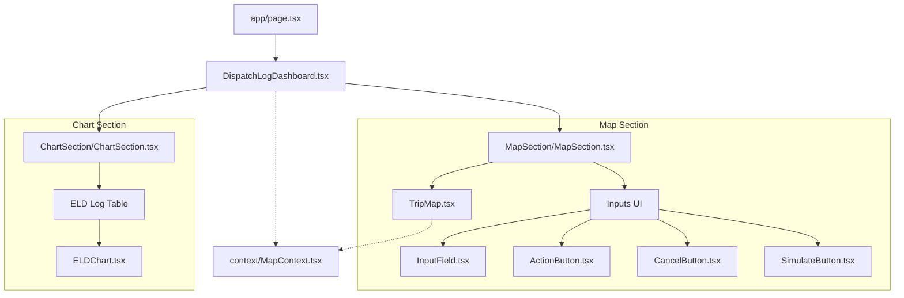

# HOS ELD Trip Visualizer Documentation

## Summary
A dispatch interface designed to simulate and visualize commercial truck trips while monitoring Hours of Service (HOS) compliance. It allows users to set current, pickup, and dropoff locations on an interactive map, enter consumed hours of the 70 hours duty cycle, and simulate the route. The application calculates the route distance and estimated time of arrival (ETA), generating a detailed Electronic Logging Device (ELD) log. These logs are visualized using a chart that tracks duty status changes (Off Duty, Driving, On Duty) across a 24-hour timeline.

## Tech Stack
*   **Next.js 16** (App Router)
*   **React 19**
*   **TypeScript 5**
*   **Bootstrap 5** (Styling)
*   **Leaflet 1.9** (Map Visualization)
*   **D3.js 7** (ELD Chart Visualization)
*   **Geoapify API** (Routing and Geocoding)

## Environment Variables Setup

```bash
NEXT_PUBLIC_GEOPIFY_KEY=your_api_key_here
BACKEND_URL=django_api_backend
```

## Component Site Map


